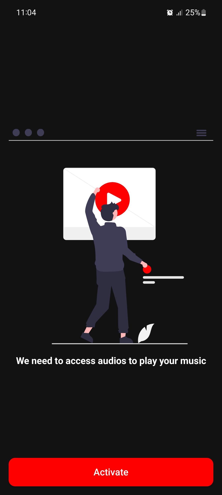
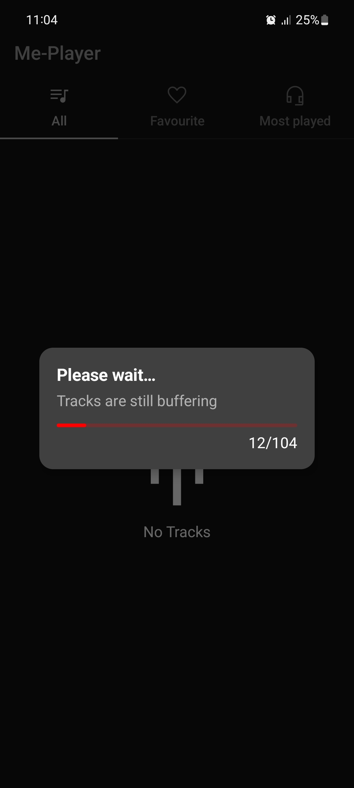
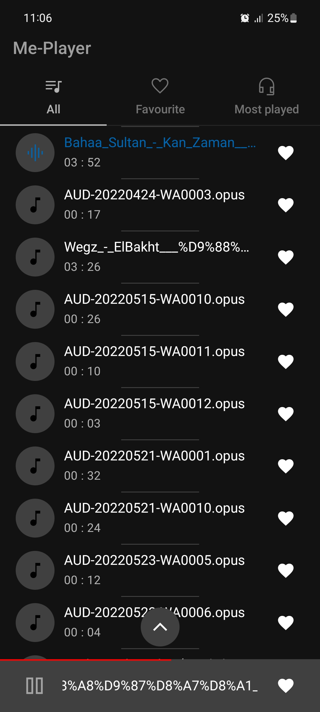
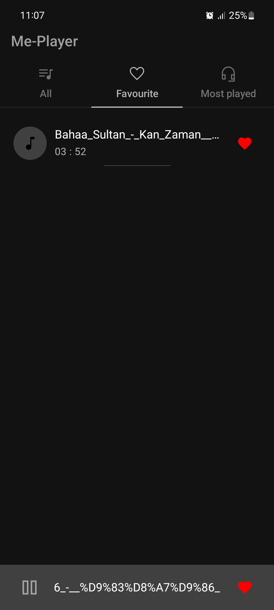
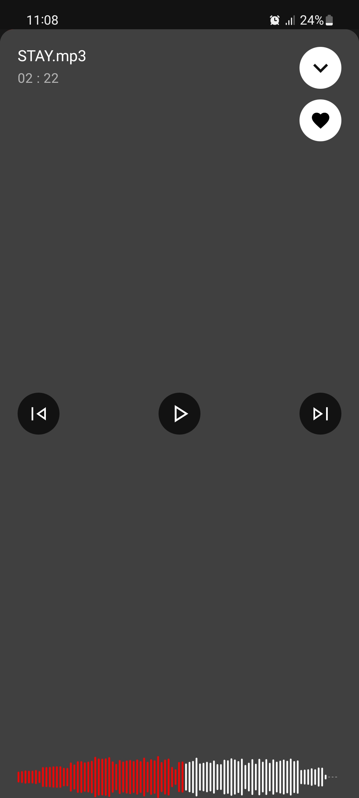

#### ```This app is still under development, you may face some bugs while using it```

### Overview
Me-Player is a sleek local music player designed exclusively for Android devices. With Me-Player, you can seamlessly play your phone's ringtone or groove to your favorite tunes.

### Screenshots
#### Your music library, beautifully organized.
<p align="center">
  
  
  
  
  
</p>

#### Transforming your ringtone into a playlist.
<p>
  
</p>


### Key Features
Local Music Player: Enjoy your favorite tracks directly from your Android device.

### Technologies Used
Me-Player is built using cutting-edge technologies:
- Compose
- Room
- Dagger-Hilt
- Media3

### Getting Started
- Clone the repository.
- Open the project in Android Studio.
- Build and run on your Android device.


```Feel the music with Me-Player!```